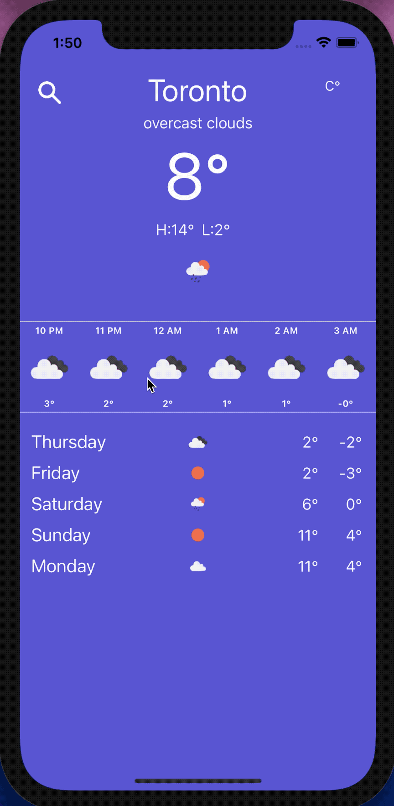
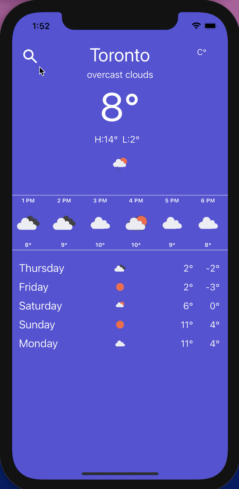
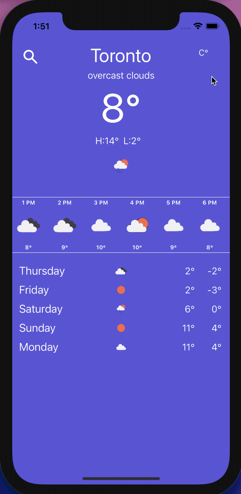

# Weather App

## Hassan Khan

## Description

An iOS application that consumes the open-source openweathermap API and displays the weather for the next 5 days as well as hourly weather as shown in the gifs below. The user may also select a different city by pressing the search icon and typing in a city name.

# 1. Hourly Weather

### The user can see hourly weather for the next 48 hours on a horizontal scrollview.

  

                                                           

# 2. Select City

### The user can type in a city name and select it to show the weather information of that city.

  

                                                                                            

# 3. Change Degree

### The user can press the degree button to change the temperature between Metric, Imperial, and Kelvin (Just for fun).

  

